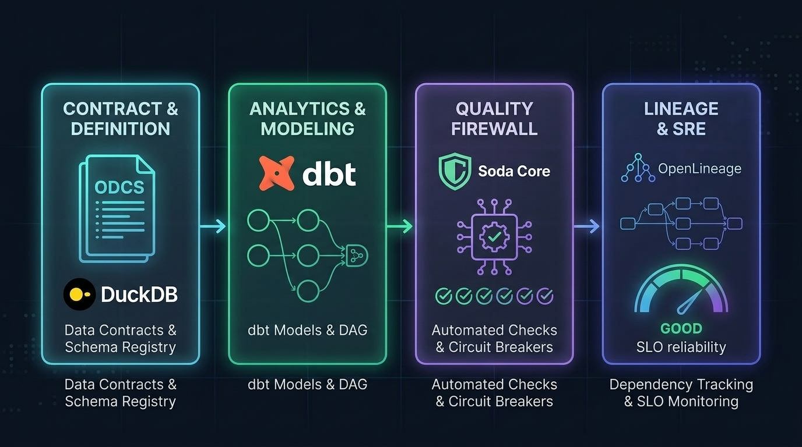

# Enterprise Data Product Management & Observability Blueprint

[](https://codespaces.new/rafaelmatsuyama/FIAP-ABD-DataProductManagement)


> **A battle-tested reference architecture and interactive lab suite for Data Mesh, Open Data Contracts (ODCS), Analytics Engineering with dbt Model Contracts, Shift-Left Quality Gates, End-to-End Lineage Tracking, and Data SRE.**

---



---

## 🎯 Executive Overview & The Paradigm Shift

Modern data engineering suffers from the **Silent Pipeline Breakage Paradox**: traditional batch and streaming pipelines fail silently when upstream microservices alter schemas, rename columns, or introduce subtle semantic drifts. Downstream analytical consumers—from executive KPI dashboards to mission-critical machine learning models—consume degraded or corrupted data for days before incidents are detected.

This repository provides an end-to-end, production-grade **Reference Architecture** designed to transition engineering organizations from fragile data pipelines to federated, self-governing **Data Products (Data as a Product - DaaP)**.

### The Four Architectural Pillars:

1. **Semantic & Interface Contracts:** Declaring formal, versioned interface specifications using the **OpenDataContract Standard (ODCS)** before data moves across domain boundaries.
2. **Contract-Driven Analytics Engineering:** Enforcing internal model contracts (`contract: enforced: true`) and structural testing in **`dbt-core`** with **`dbt-expectations`**.
3. **Shift-Left Quality Gates & Circuit Breakers:** Deploying automated quality firewalls on the ingestion edge with **Soda Core (SodaCL)** to quarantine anomalous records before warehouse materialization.
4. **Operational Lineage & Data SRE:** Emitting standardized run and dataset facets with **OpenLineage**, capturing graphs in **Marquez**, and managing **Data Downtime** through automated **SLO/SLI auditing and Error Budget enforcement**.

---

## 🏗️ End-to-End Architectural Flow

```
┌─────────────────────────────────────────────────────────────────────────────────────────────┐
│                                   UPSTREAM DOMAIN SOURCES                                   │
│                        Operational Systems / Microservices / Logs (DuckDB)                  │
└──────────────────────────────────────────────┬──────────────────────────────────────────────┘
                                               │
                                               ▼
┌─────────────────────────────────────────────────────────────────────────────────────────────┐
│ 1. CONTRACT DEFINITION & SCHEMA SPECIFICATION (Labs 01 & 02)                                │
│    • Data Product Canvas: Business Domain, Value Proposition & SLA / SLO Definition        │
│    • OpenDataContract Standard (ODCS): datacontract.yaml with JSON Schema export            │
│    • Breaking-Change Detection: Automated linting & schema enforcement before merge         │
└──────────────────────────────────────────────┬──────────────────────────────────────────────┘
                                               │
                                               ▼
┌─────────────────────────────────────────────────────────────────────────────────────────────┐
│ 2. ANALYTICS ENGINEERING & MODEL CONTRACTS (Labs 03 & 04)                                   │
│    • dbt-duckdb Data Mesh Layers: Staging (View) ──► Intermediate ──► Marts (Table)        │
│    • Internal Model Contracts: contract: enforced: true preventing column/type drift       │
│    • Shift-Left Asserções: dbt build + dbt-expectations statistical test suite               │
└──────────────────────────────────────────────┬──────────────────────────────────────────────┘
                                               │
                                               ▼
┌─────────────────────────────────────────────────────────────────────────────────────────────┐
│ 3. SHIFT-LEFT DATA QUALITY FIREWALL (Lab 05)                                                │
│    • Soda Core (SodaCL): Anomaly detection, null checks, freshness & value range gates     │
│    • Circuit Breaker Engine: Halts downstream materialization upon critical check failures   │
└──────────────────────────────────────────────┬──────────────────────────────────────────────┘
                                               │
                                               ▼
┌─────────────────────────────────────────────────────────────────────────────────────────────┐
│ 4. END-TO-END OBSERVABILITY, LINEAGE & DATA SRE (Labs 06 & 07)                              │
│    • OpenLineage Telemetry: Event emission with SchemaDatasetFacet & ErrorMessageRunFacet    │
│    • Marquez Server & UI: Complete DAG lineage graph from ingestion to consumption          │
│    • Dynamic Blast Radius: Bipartite Graph BFS algorithm to identify impacted consumers     │
│    • Data SRE & Reliability: Availability SLI, MTTD, MTTR, Monthly Error Budget Audit       │
│    • Automated Governance: Automatic issuance of DEPLOY_FREEZE.md & Reliability Reports     │
└─────────────────────────────────────────────────────────────────────────────────────────────┘
```

---

## 🧪 Modular Hands-on Lab Suite

The repository is divided into 8 self-contained, sequential hands-on laboratories. Each module solves a concrete enterprise engineering problem:

| Module | Enterprise Pain Point | Technical Solution & Modern Stack | Key Deliverable & Artifact |
| :--- | :--- | :--- | :--- |
| [`lab00-setup`](./lab00-setup) | Environment inconsistency and local dependency conflicts | GitHub Codespaces (DevContainer) + Self-Healing DuckDB | Reproducible ephemeral runtime & transactional data generator |
| [`lab01-canvas`](./lab01-canvas) | Lack of product thinking and undefined interfaces | Data Product Canvas + JSON Schema Specification | Domain value mapping & schema contract validation engine |
| [`lab02-contracts`](./lab02-contracts) | Upstream producers introducing breaking schema drifts | OpenDataContract Standard (ODCS) + `datacontract-cli` | Versioned `datacontract.yaml` & breaking-change test suite |
| [`lab03-dbt-modeling`](./lab03-dbt-modeling) | Monolithic SQL transformations without schema guarantees | `dbt-core` + `dbt-duckdb` with Model Contracts | Enforced model contracts (`contract: enforced: true`) |
| [`lab04-dbt-testing`](./lab04-dbt-testing) | Silent data corruption slipping past basic SQL tests | `dbt-expectations` (`metaplane`) + unified `dbt build` | Shift-left testing pyramid & distribution assertions |
| [`lab05-soda-quality`](./lab05-soda-quality) | Corrupt data contaminating production warehouse | `Soda Core` (SodaCL) Quality Gates & Circuit Breakers | Edge quality firewall with automated anomaly quarantine |
| [`lab06-openlineage`](./lab06-openlineage) | Unknown blast radius when modifying upstream tables | `OpenLineage` + `Marquez` (Docker) + Dynamic BFS Graph | Automated lineage telemetry & downstream blast radius calculator |
| [`lab07-downtime-incident`](./lab07-downtime-incident) | Unmeasured data downtime and SLA/SLO violations | Marquez REST API + SRE Reliability & Error Budget Engine | Automated `DEPLOY_FREEZE.md` policy & incident audit report |

---

## 🚀 One-Click Quickstart (Zero-Friction Bootstrap)

### Option A: GitHub Codespaces (Recommended)

Click the button below to launch a fully-configured Linux cloud container with Docker, Python 3.11+, and all dependencies pre-installed:

[](https://codespaces.new/rafaelmatsuyama/FIAP-ABD-DataProductManagement)

*Once Codespaces is ready:*
```bash
# 1. Install dependencies for the target module (e.g., Module 01)
pip install -r requirements-aula01.txt

# 2. Navigate to the desired laboratory
cd lab01-canvas

# 3. Follow the guided instructions in the student manual
cat "Lab 01 - Roteiro Aluno.md"
```

### Option B: Local Machine Execution

**Prerequisites:** Python 3.11+, Docker & Docker Compose (for Labs 06 & 07), Git.

```bash
# Clone the repository
git clone https://github.com/rafaelmatsuyama/FIAP-ABD-DataProductManagement.git
cd FIAP-ABD-DataProductManagement

# Create and activate a virtual environment
python -m venv .venv
source .venv/bin/activate  # On Windows: .venv\Scripts\activate

# Install modular requirements for the session:
# For Labs 00 - 02:
pip install -r requirements-aula01.txt

# For Labs 03 - 04:
pip install -r requirements-aula02.txt

# For Labs 05 - 07:
pip install -r requirements-aula03.txt
```

---

## ⚙️ Key Architectural Patterns & Production Hardening

This reference implementation incorporates critical real-world architectural solutions developed during production testing:

* **Modular Dependency Isolation:** Solves the known backtracking dependency resolver conflict between `dbt-core`, `soda-core`, and `datacontract-cli` by segmenting requirements into modular manifests (`requirements-aula01.txt`, `requirements-aula02.txt`, `requirements-aula03.txt`), reducing build times from >15 minutes to <10 seconds.
* **Codespaces Docker Networking (`network_mode: host`):** In virtualized DevContainer environments (Docker-in-Docker), bridge networks frequently drop inter-container packets. Labs 06 and 07 employ `network_mode: host` with direct loopback binding, guaranteeing zero-latency communication across Marquez API (`:5000`), Postgres (`:5432`), and Marquez UI (`:3000`).
* **Dynamic Blast Radius Analysis:** Lab 06 replaces static mock lineage graphs with an algorithmic graph engine. It parses active OpenLineage metadata, constructs a bipartite DAG of jobs and datasets, and executes Breadth-First Search (BFS) to compute the exact blast radius of affected consumers (BI Dashboards, Feature Stores, Regulatory Feeds).
* **Automated Data SRE Governance:** Lab 07 queries operational run facets from the Marquez REST API to calculate Availability SLIs, MTTD, MTTR, and Error Budget consumption over rolling 30-day windows. If the error budget breaches the 99.0% SLO, the engine automatically issues a legally binding `DEPLOY_FREEZE.md` policy document.

---

## 🎓 Academic Validation & Field Hardening

This framework and interactive lab suite were architected, refined, and battle-tested by **Rafael Matsuyama** as part of the **Data Product Management & Value Delivery** curriculum for the **Executive MBA in Data Engineering at FIAP** (São Paulo, Brazil).

Over 100+ senior data engineers, solutions architects, and tech leads across multiple enterprise cohorts have stress-tested these scenarios, providing continuous feedback to ensure these patterns solve real-world corporate data delivery challenges.

---

## 👨‍💻 Author & Leadership

**Rafael Matsuyama**  
*Solutions Architect & Data Engineering Specialist*  
Engineering graduate from **Escola Politécnica da Universidade de São Paulo (Poli-USP)** with over two decades of experience across Cloud Architecture, Distributed Systems, Mission-Critical Platforms, and Academic Leadership.

* 🌐 **LinkedIn:** [linkedin.com/in/rafaelmatsuyama](https://www.linkedin.com/in/rafaelmatsuyama)
* 🐙 **GitHub:** [github.com/rafaelmatsuyama](https://github.com/rafaelmatsuyama)

---

## 📜 Dual Licensing Model

This repository employs a **dual-licensing structure** to encourage enterprise adoption of the codebase while protecting educational materials from unauthorized commercial resale:

* 💻 **Code, Scripts & Configurations (`.py`, `.sql`, `.yaml`, Docker):** Licensed under the **[Apache 2.0 License](LICENSE)**. Permissive and free to be used, adapted, and integrated into enterprise production environments.
* 📚 **Educational Content & Manuals (`*.md` lab guides, canvas, diagrams):** Licensed under **[Creative Commons Attribution-NonCommercial-ShareAlike 4.0 International (CC BY-NC-SA 4.0)](https://creativecommons.org/licenses/by-nc-sa/4.0/)**. Free for personal learning, study, and educational reference; commercial reproduction, selling, or course packaging by third parties is strictly prohibited.
